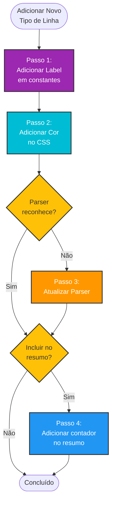
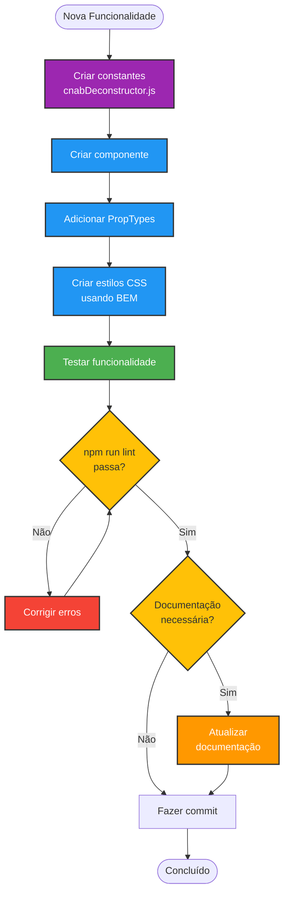

# Estendendo o Desconstrutor CNAB

## Visão Geral
Este guia explica como estender e customizar o Desconstrutor CNAB para adicionar novas funcionalidades, tipos de linha, ou componentes.

## Sumário
- [Adicionar Novo Tipo de Linha](#adicionar-novo-tipo-de-linha)
- [Adicionar Nova Funcionalidade](#adicionar-nova-funcionalidade)
- [Customizar Componente Existente](#customizar-componente-existente)
- [Adicionar Novos Textos](#adicionar-novos-textos)
- [Criar Novo Componente Reutilizável](#criar-novo-componente-reutilizável)
- [Adicionar Novos Estilos](#adicionar-novos-estilos)

---

## Adicionar Novo Tipo de Linha

### Fluxo de Extensão



### Passo 1: Adicionar Label ao Arquivo de Constantes

Edite `src/constants/cnabDeconstructor.js`:

```javascript
export const LINE_TYPE_LABELS = {
  header: 'Header',
  registro1: 'Registro 1 (Transação)',
  registro2: 'Registro 2 (Mensagens)',
  registro3: 'Registro 3 (Split)',
  registro7: 'Registro 7 (Endereço)',
  registro5: 'Registro 5 (Novo Tipo)', // ← ADICIONE AQUI
  trailer: 'Trailer',
  unknown: 'Desconhecido'
};
```

### Passo 2: Adicionar Cor no CSS

Edite `src/styles/components/CnabDeconstructor.css`:

```css
.line-title__indicator--registro5 {
  background-color: #E91E63; /* Rosa */
}
```

**Cores sugeridas disponíveis**:
- Rosa: `#E91E63`
- Índigo: `#3F51B5`
- Verde-limão: `#CDDC39`
- Âmbar: `#FFC107`
- Marrom: `#795548`

### Passo 3: Atualizar o Parser (se necessário)

Se o parser ainda não reconhece esse tipo, edite `src/scripts/CNAB/cnabParser.js`:

```javascript
function identifyLineType(line) {
  const firstChar = line[0];
  
  if (firstChar === '0') return 'header';
  if (firstChar === '1') return 'registro1';
  if (firstChar === '2') return 'registro2';
  if (firstChar === '3') return 'registro3';
  if (firstChar === '5') return 'registro5'; // ← ADICIONE AQUI
  if (firstChar === '7') return 'registro7';
  if (firstChar === '9') return 'trailer';
  
  return 'unknown';
}
```

### Passo 4: Adicionar Contador no Resumo (opcional)

Se quiser exibir contagem desse tipo no resumo, edite:

**Constantes** (`src/constants/cnabDeconstructor.js`):
```javascript
export const UI_TEXT = {
  // ...outras constantes
  registro5Label: 'Registro 5:',
  // ...
};
```

**Componente FileSummary** (`src/components/CnabDeconstructor/FileSummary.jsx`):
```jsx
<p><strong>{UI_TEXT.registro5Label}</strong> {summary.registro5}</p>
```

**Parser** (garantir que conta esse tipo):
```javascript
summary.registro5 = lines.filter(l => l.lineType === 'registro5').length;
```

---

## Adicionar Nova Funcionalidade

### Exemplo: Adicionar Botão de Exportação JSON

#### Passo 1: Adicionar Texto na Constante

Edite `src/constants/cnabDeconstructor.js`:

```javascript
export const UI_TEXT = {
  // ...textos existentes
  exportJsonButton: 'Exportar como JSON',
};
```

#### Passo 2: Criar Função no Componente Principal

Edite `src/pages/CnabDeconstructor.jsx`:

```javascript
const handleExportJson = () => {
  const dataStr = JSON.stringify(parsedData, null, 2);
  const dataBlob = new Blob([dataStr], { type: 'application/json' });
  const url = URL.createObjectURL(dataBlob);
  const link = document.createElement('a');
  link.href = url;
  link.download = `${fileName.replace(/\.[^/.]+$/, '')}.json`;
  link.click();
  URL.revokeObjectURL(url);
};
```

#### Passo 3: Adicionar Botão na UI

```jsx
{parsedData && (
  <div className="row mb-3">
    <div className="col-12">
      <button 
        onClick={handleExportJson}
        className="btn btn-primary">
        {UI_TEXT.exportJsonButton}
      </button>
    </div>
  </div>
)}
```

---

## Customizar Componente Existente

### Exemplo: Adicionar Filtro por Tipo de Linha

#### Passo 1: Criar Novo Componente de Filtro

Crie `src/components/CnabDeconstructor/LineTypeFilter.jsx`:

```jsx
import PropTypes from 'prop-types';
import { LINE_TYPE_LABELS } from '../../constants/cnabDeconstructor';

function LineTypeFilter({ selectedTypes, onFilterChange }) {
  const types = Object.keys(LINE_TYPE_LABELS);
  
  const handleToggle = (type) => {
    if (selectedTypes.includes(type)) {
      onFilterChange(selectedTypes.filter(t => t !== type));
    } else {
      onFilterChange([...selectedTypes, type]);
    }
  };

  return (
    <div className="line-type-filter">
      <h5>Filtrar por tipo:</h5>
      {types.map(type => (
        <label key={type}>
          <input 
            type="checkbox"
            checked={selectedTypes.includes(type)}
            onChange={() => handleToggle(type)}
          />
          {LINE_TYPE_LABELS[type]}
        </label>
      ))}
    </div>
  );
}

LineTypeFilter.propTypes = {
  selectedTypes: PropTypes.arrayOf(PropTypes.string).isRequired,
  onFilterChange: PropTypes.func.isRequired,
};

export default LineTypeFilter;
```

#### Passo 2: Adicionar Estado no Componente Principal

Edite `src/pages/CnabDeconstructor.jsx`:

```javascript
const [selectedTypes, setSelectedTypes] = useState([]);

// Filtrar linhas
const filteredLines = parsedData 
  ? parsedData.lines.filter(line => 
      selectedTypes.length === 0 || selectedTypes.includes(line.lineType)
    )
  : [];
```

#### Passo 3: Integrar na UI

```jsx
{parsedData && (
  <>
    <LineTypeFilter 
      selectedTypes={selectedTypes}
      onFilterChange={setSelectedTypes}
    />
    <ParsedDataView 
      parsedData={{ ...parsedData, lines: filteredLines }} 
    />
  </>
)}
```

---

## Adicionar Novos Textos

### Para Textos Simples

Edite `src/constants/cnabDeconstructor.js`:

```javascript
export const UI_TEXT = {
  // ...textos existentes
  novoTexto: 'Meu novo texto aqui',
  novoLabel: 'Novo Label:',
};
```

### Para Textos Dinâmicos

```javascript
export const UI_TEXT = {
  // ...textos existentes
  linhasProcessadas: (count) => `${count} linha${count === 1 ? '' : 's'} processada${count === 1 ? '' : 's'}`,
};
```

**Uso**:
```jsx
<p>{UI_TEXT.linhasProcessadas(parsedData.summary.totalLines)}</p>
```

### Para Mensagens de Toast

```javascript
export const TOAST_MESSAGES = {
  fileLoaded: {
    icon: 'success',
    title: 'Arquivo carregado!',
    getText: (lineCount) => `${lineCount} linha(s) processada(s)`
  },
  // ADICIONE AQUI
  fileError: {
    icon: 'error',
    title: 'Erro ao carregar',
    getText: (error) => `Falha: ${error}`
  }
};
```

---

## Criar Novo Componente Reutilizável

### Fluxo de Criação de Componente

```mermaid
graph LR
    A([Criar Novo<br/>Componente]) --> B[1. Criar arquivo JSX]
    B --> C[2. Adicionar PropTypes]
    C --> D[3. Adicionar constantes<br/>se necessário]
    D --> E[4. Criar estilos CSS]
    E --> F[5. Importar no<br/>componente pai]
    F --> G[6. Usar no JSX]
    G --> H([Testar & Lint])
    
    classDef fileNode fill:#4CAF50,stroke:#333,stroke-width:2px,color:#fff
    classDef validationNode fill:#9C27B0,stroke:#333,stroke-width:2px,color:#fff
    classDef constantNode fill:#FF9800,stroke:#333,stroke-width:2px,color:#fff
    classDef cssNode fill:#00BCD4,stroke:#333,stroke-width:2px,color:#fff
    classDef integrationNode fill:#2196F3,stroke:#333,stroke-width:2px,color:#fff
    
    class B fileNode
    class C validationNode
    class D constantNode
    class E cssNode
    class F,G integrationNode
```



### Template de Componente

Crie `src/components/CnabDeconstructor/MeuComponente.jsx`:

```jsx
import PropTypes from 'prop-types';
import { UI_TEXT } from '../../constants/cnabDeconstructor';

function MeuComponente({ prop1, prop2 }) {
  return (
    <div className="meu-componente">
      <h4>{UI_TEXT.meuTitulo}</h4>
      <p>{prop1}</p>
      <span>{prop2}</span>
    </div>
  );
}

MeuComponente.propTypes = {
  prop1: PropTypes.string.isRequired,
  prop2: PropTypes.number,
};

MeuComponente.defaultProps = {
  prop2: 0,
};

export default MeuComponente;
```

### Adicionar Estilos

Crie ou edite `src/styles/components/CnabDeconstructor.css`:

```css
/* Meu Componente */
.meu-componente {
  padding: 10px;
  border: 1px solid var(--border-color);
  border-radius: 4px;
}

.meu-componente h4 {
  margin: 0 0 10px 0;
  color: var(--primary-color);
}
```

### Usar no Componente Principal

```jsx
import MeuComponente from '../components/CnabDeconstructor/MeuComponente';

// No JSX:
<MeuComponente prop1="teste" prop2={42} />
```

---

## Adicionar Novos Estilos

### Para Estilos Específicos do Desconstrutor

Edite `src/styles/components/CnabDeconstructor.css`:

```css
/* Nova Funcionalidade */
.nova-classe {
  /* seus estilos */
}

.nova-classe__elemento {
  /* BEM modifier */
}

.nova-classe--modificador {
  /* BEM state */
}
```

### Para Estilos Globais Reutilizáveis

Edite `src/styles/utils.css`:

```css
/* Adicione no final do arquivo */
.minha-classe-global {
  /* estilos */
}
```

### Adicionar Nova Variável CSS

Edite `src/styles/utils.css` na seção `:root`:

```css
:root {
  --danger-color: #dc3545;
  /* ...outras variáveis */
  --minha-nova-cor: #FF5722; /* ADICIONE AQUI */
}
```

**Uso**:
```css
.meu-elemento {
  color: var(--minha-nova-cor);
}
```

---

## Boas Práticas

### ✅ Sempre Use Constantes
❌ **Errado**:
```jsx
<h2>Desconstrutor CNAB 400/444</h2>
```

✅ **Correto**:
```jsx
<h2>{UI_TEXT.pageTitle}</h2>
```

### ✅ Sempre Defina PropTypes
```javascript
ComponentName.propTypes = {
  prop1: PropTypes.string.isRequired,
  prop2: PropTypes.number,
};
```

### ✅ Use Metodologia BEM para CSS
```css
/* Bloco */
.nome-componente { }

/* Elemento */
.nome-componente__elemento { }

/* Modificador */
.nome-componente--modificador { }
```

### ✅ Prefira Variáveis CSS
❌ **Errado**:
```css
.elemento {
  color: #999;
}
```

✅ **Correto**:
```css
.elemento {
  color: var(--muted-color);
}
```

### ✅ Componentes Pequenos e Focados
- Cada componente deve ter uma responsabilidade
- Máximo ~100 linhas por componente
- Se crescer muito, divida em componentes menores

### ✅ Mantenha Hierarquia de Pastas
```
src/
├── components/
│   └── CnabDeconstructor/  ← Componentes específicos aqui
│       ├── FileSummary.jsx
│       ├── LineTitle.jsx
│       └── ...
├── constants/
│   └── cnabDeconstructor.js  ← Constantes aqui
├── pages/
│   └── CnabDeconstructor.jsx  ← Página principal aqui
└── styles/
    └── components/
        └── CnabDeconstructor.css  ← Estilos aqui
```

---

## Checklist para Novas Funcionalidades



**Itens do Checklist**:
- [ ] Criar constantes em `cnabDeconstructor.js`
- [ ] Criar componente(s) necessário(s)
- [ ] Adicionar PropTypes em todos componentes
- [ ] Criar estilos CSS usando BEM
- [ ] Testar funcionalidade
- [ ] Rodar `npm run lint` (deve passar sem erros)
- [ ] Atualizar documentação se necessário
- [ ] Fazer commit com mensagem descritiva

---

## Exemplos de Extensões Comuns

### 1. Adicionar Busca/Filtro
- Componente: `SearchBar.jsx`
- Estado: `searchTerm`
- Filtro: Aplicar em `parsedData.lines`

### 2. Adicionar Paginação
- Componente: `Pagination.jsx`
- Estado: `currentPage`, `itemsPerPage`
- Lógica: Slice do array de linhas

### 3. Adicionar Download em Múltiplos Formatos
- Função: `handleExportAs(format)`
- Formatos: JSON, CSV, XML
- Componente: `ExportMenu.jsx`

### 4. Adicionar Comparação de Arquivos
- Estado: `secondFile`
- Componente: `FileComparison.jsx`
- Lógica: Diff entre dois `parsedData`

### 5. Adicionar Validações Customizadas
- Arquivo: `validators.js`
- Componente: `ValidationResults.jsx`
- Integrar no parser ou pós-processamento

---

## Resolução de Problemas

### Componente não aparece
1. Verificar import correto
2. Checar se está sendo renderizado condicionalmente
3. Verificar PropTypes (pode estar faltando prop obrigatória)
4. Verificar console do navegador para erros

### Estilos não aplicam
1. Verificar se CSS foi importado
2. Checar especificidade CSS (BEM evita isso)
3. Verificar nome das classes (typo?)
4. Usar DevTools para inspecionar elemento

### Constante não encontrada
1. Verificar export em `cnabDeconstructor.js`
2. Verificar import no componente
3. Verificar nome exato (case-sensitive)

### Lint falhando
```bash
npm run lint
```
- Verificar imports não utilizados
- Verificar PropTypes faltando
- Verificar formatação (use o auto-fix do ESLint)

---

## Recursos Adicionais

- [Documentação da Estrutura](./estrutura-desconstrutor-cnab.md)
- [Estrutura do Gerador CNAB](./estrutura-cnab.md)
- [React PropTypes](https://reactjs.org/docs/typechecking-with-proptypes.html)
- [BEM Methodology](http://getbem.com/)
- [CSS Variables](https://developer.mozilla.org/en-US/docs/Web/CSS/Using_CSS_custom_properties)
