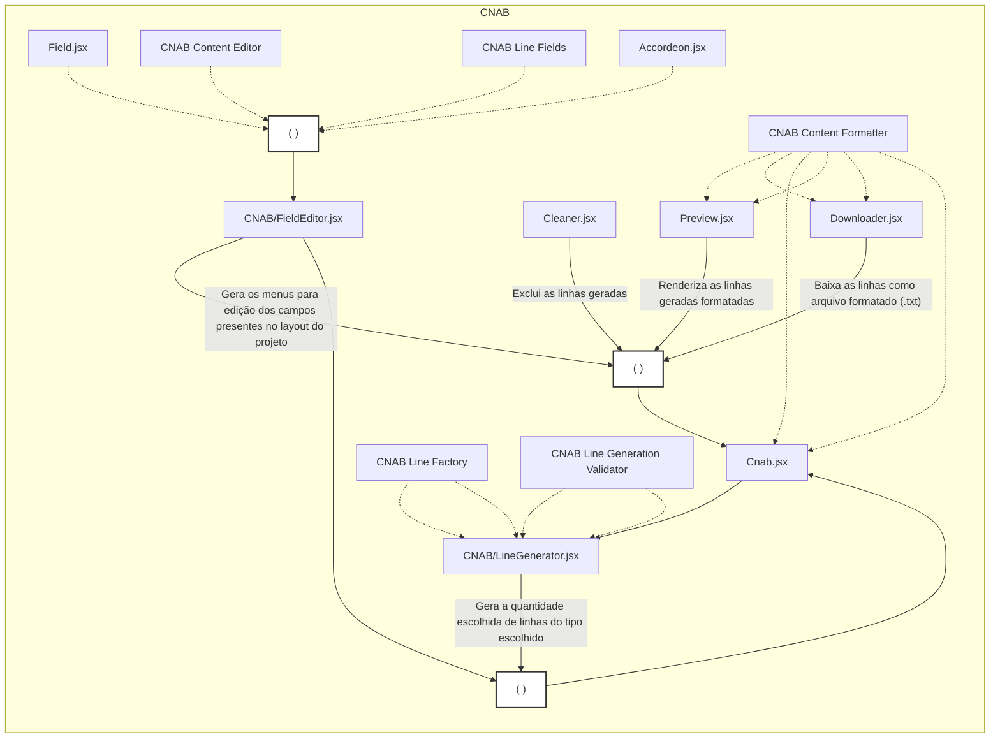

# Estrutura do Gerador CNAB

## Visão Geral
O gerador CNAB é composto por diversos componentes e scripts que trabalham em conjunto para criar arquivos CNAB de cobrança. Este documento apresenta a arquitetura e o fluxo de dados do sistema.

## Diagrama de Arquitetura



## Componentes Principais

### 📄 `Cnab.jsx`
**Caminho**: `src/pages/Cnab.jsx`

Componente principal da página de geração CNAB. Orquestra todos os outros componentes e gerencia o estado das linhas geradas.

**Responsabilidades**:
- Gerenciar estado das linhas geradas
- Coordenar componentes filhos (Preview, Cleaner, Downloader, etc.)
- Passar dados entre componentes
- Usar `ContentFormatter` para formatação

---

### 🎨 `Preview.jsx`
**Caminho**: `src/components/Preview.jsx`

Exibe as linhas CNAB geradas em formato de pré-visualização.

**Funcionalidades**:
- Renderiza linhas formatadas com largura fixa
- Usa `ContentFormatter` para formatar dados
- Exibe preview do arquivo final
- Mostra numeração das linhas

---

### 🧹 `Cleaner.jsx`
**Caminho**: `src/components/Cleaner.jsx`

Botão para limpar/excluir todas as linhas geradas.

**Funcionalidades**:
- Limpa estado das linhas
- Reset do gerador
- Confirmação antes de limpar

---

### 💾 `Downloader.jsx`
**Caminho**: `src/components/Downloader.jsx`

Componente responsável por baixar o arquivo CNAB.

**Funcionalidades**:
- Formata conteúdo usando `ContentFormatter`
- Gera arquivo `.txt` ou `.rem` para download
- Cria blob e trigger de download
- Valida conteúdo antes do download

---

### ⚙️ `CNAB/LineGenerator.jsx`
**Caminho**: `src/components/CNAB/LineGenerator.jsx`

Componente para geração de novas linhas CNAB.

**Funcionalidades**:
- Interface para escolher tipo de registro (1, 2, 3, 7)
- Interface para escolher quantidade de linhas
- Usa `LineFactory` para criar linhas
- Usa `LineValidator` para validar antes de gerar
- Adiciona linhas ao estado do componente pai

**Dependências**:
- `LineFactory` - Cria linhas baseado nos campos configurados
- `LineValidator` - Valida se a linha pode ser gerada

---

### ✏️ `CNAB/FieldEditor.jsx`
**Caminho**: `src/components/CNAB/FieldEditor.jsx`

Editor de campos CNAB, permite personalizar valores de cada campo.

**Funcionalidades**:
- Renderiza formulários para edição de campos
- Usa `LineFields` para saber quais campos existem
- Organiza campos por tipo de registro (header, registro1, registro2, etc.)
- Usa `Accordeon` para UI expansível
- Valida tamanho dos campos (startIndex/endIndex)

**Dependências**:
- `Field.jsx` - Componente individual de campo
- `ContentEditor` - Lógica de edição
- `Accordeon.jsx` - UI de accordion
- `LineFields` - Definição dos campos

---

### 🔤 `Field.jsx`
**Caminho**: `src/components/Field.jsx`

Componente reutilizável para renderizar um campo individual.

**Funcionalidades**:
- Renderiza input para campo
- Gerencia valor do campo
- Mostra descrição e limites
- Validação de tamanho (maxLength)

---

### 📦 `Accordeon.jsx`
**Caminho**: `src/components/Accordeon.jsx`

Componente de UI para seções expansíveis/colapsáveis.

**Funcionalidades**:
- Agrupa campos por tipo de registro
- Expande/colapsa seções
- Aceita estilos personalizados via props

---

## Scripts e Utilitários

### 🏭 `CNAB Line Factory`
**Caminho**: `src/scripts/CNAB/lineFactory.js`

Factory function que cria linhas CNAB baseado nos campos configurados.

**Funcionalidades**:
- Lê configuração de `LineFields`
- Aplica valores default
- Aplica padding (zeros à esquerda ou espaços à direita)
- Garante posições fixas (startIndex/endIndex)
- Retorna linha com tamanho exato (400 ou 444 caracteres)

---

### 📋 `CNAB Line Fields`
**Caminho**: `src/scripts/CNAB/lineFields.js`

Configuração dos campos do CNAB por tipo de registro.

**Estrutura**:
```javascript
const fields = {
  header: HEADER_FIELDS,
  registro1: REGISTRO1_FIELDS,
  registro2: REGISTRO2_FIELDS,
  registro3: REGISTRO3_FIELDS,
  registro7: REGISTRO7_FIELDS,
  trailer: TRAILER_FIELDS
}
```

**Formato de Campo**:
```javascript
{
  name: 'nomeCampo',
  description: 'Descrição',
  startIndex: 1,
  endIndex: 10,
  defaultValue: () => 'valor',
  maxLength: 10,
  paddingType: '0' | ' ',
}
```

---

### ✅ `CNAB Line Generation Validator`
**Caminho**: `src/scripts/CNAB/lineGenerationValidator.js`

Validador que verifica se linhas podem ser geradas conforme regras do CNAB.

**Funcionalidades**:
- Valida ordem de registros (registro1 deve vir antes de 2, 3, 7)
- Valida sequência de registros
- Verifica dependências entre tipos de registro
- Retorna erros se validação falhar

**Regras Validadas**:
- Registros 2, 3 e 7 precisam de um registro 1 precedente
- Registros não podem repetir (exceto registro 1)
- Header deve ser a primeira linha
- Trailer deve ser a última linha

---

### ✏️ `CNAB Content Editor`
**Caminho**: `src/scripts/CNAB/contentEditor.js`

Lógica para edição de conteúdo CNAB.

**Funcionalidades**:
- Atualiza valores de campos em posições específicas
- Valida alterações respeitando startIndex/endIndex
- Mantém tamanho da linha constante
- Aplica padding quando necessário

---

### 🎨 `CNAB Content Formatter`
**Caminho**: `src/scripts/CNAB/contentFormatter.js`

Formata conteúdo CNAB para exibição e download.

**Funcionalidades**:
- Formata linhas com largura fixa
- Adiciona quebras de linha
- Garante formato correto para arquivo
- Valida tamanho das linhas (400/444 caracteres)

**Usado por**:
- `Preview.jsx`
- `Downloader.jsx`
- `Cnab.jsx`

---

## Fluxo de Dados

### 1. Geração de Linhas
```
Usuário escolhe tipo de registro e quantidade
    ↓
LineGenerator.jsx
    ↓
LineValidator valida a geração
    ↓
LineFactory cria linhas (usa LineFields)
    ↓
Aplica padding e posições fixas
    ↓
Novas linhas adicionadas ao estado
    ↓
Preview.jsx atualiza com ContentFormatter
```

### 2. Edição de Campos
```
Usuário abre FieldEditor
    ↓
FieldEditor renderiza campos (LineFields)
    ↓
Accordeon agrupa por tipo de registro
    ↓
Field.jsx para cada campo
    ↓
ContentEditor atualiza valores
    ↓
Valida startIndex/endIndex
    ↓
Aplica padding
    ↓
Estado atualizado
```

### 3. Download
```
Usuário clica em Download
    ↓
Downloader.jsx
    ↓
Valida linhas (header, trailer, sequência)
    ↓
ContentFormatter formata linhas
    ↓
Blob criado com conteúdo CNAB
    ↓
Arquivo .txt/.rem baixado
```

### 4. Limpeza
```
Usuário clica em Limpar
    ↓
Cleaner.jsx
    ↓
Confirmação
    ↓
Estado resetado
    ↓
Preview limpa
```

## Relacionamentos entre Componentes

### Componentes de UI (Sólidos)
Linhas sólidas no diagrama indicam componentes React que renderizam UI:
- `Cnab.jsx` ← componente raiz
- `Preview.jsx`, `Cleaner.jsx`, `Downloader.jsx` ← utilidades
- `LineGenerator.jsx`, `FieldEditor.jsx` ← geradores/editores
- `Field.jsx`, `Accordeon.jsx` ← componentes reutilizáveis

### Scripts/Utilitários (Pontilhados)
Linhas pontilhadas indicam dependências de scripts/configurações:
- `LineFactory` - função de geração com posições fixas
- `LineValidator` - validação de regras de sequência
- `ContentFormatter` - formatação de saída
- `ContentEditor` - lógica de edição
- `LineFields` - configuração de campos por registro

## Diferenças entre CNAB e CSV

| Aspecto | CNAB | CSV |
|---------|------|-----|
| Posições fixas | ✅ Sim (startIndex/endIndex) | ❌ Não |
| Padding | ✅ Obrigatório ('0' ou ' ') | ❌ Não necessário |
| Tamanho de linha | ✅ Fixo (400/444 caracteres) | ❌ Variável |
| Separador | ❌ Não tem | ✅ Vírgula/ponto-e-vírgula |
| Tipos de linha | ✅ Registros (header/1/2/3/7/trailer) | ❌ Apenas dados |
| Validação | ✅ Sequência obrigatória | ❌ Livre |
| Extensão arquivo | `.txt` ou `.rem` | `.csv` |

## Extensibilidade

### Para adicionar um novo campo CNAB:
1. Edite `src/scripts/CNAB/lineFields.js`
2. Adicione objeto no array do tipo de registro apropriado
3. Defina `name`, `description`, `startIndex`, `endIndex`, `defaultValue`, `maxLength`, `paddingType`
4. O campo aparecerá automaticamente no `FieldEditor`

### Para adicionar um novo tipo de registro:
1. Adicione nova constante em `lineFields.js` (ex: `REGISTRO5_FIELDS`)
2. Adicione ao objeto `fields`: `registro5: REGISTRO5_FIELDS`
3. Atualize `LineGenerator` para incluir opção do novo registro
4. Atualize `LineValidator` se houver regras específicas

### Para personalizar validações:
1. Edite `src/scripts/CNAB/lineGenerationValidator.js`
2. Adicione novas regras de validação
3. Retorne erros descritivos

### Para personalizar o formato de saída:
1. Edite `src/scripts/CNAB/contentFormatter.js`
2. Ajuste a função de formatação conforme necessário

## Arquivos Principais

```
src/
├── pages/
│   └── Cnab.jsx                          # Página principal
├── components/
│   ├── Preview.jsx                       # Preview de linhas
│   ├── Cleaner.jsx                       # Botão limpar
│   ├── Downloader.jsx                    # Botão download
│   ├── Field.jsx                         # Campo individual
│   ├── Accordeon.jsx                     # UI accordion
│   └── CNAB/
│       ├── LineGenerator.jsx             # Gerador de linhas
│       └── FieldEditor.jsx               # Editor de campos
└── scripts/
    └── CNAB/
        ├── lineFactory.js                # Factory de linhas
        ├── lineFields.js                 # Configuração de campos
        ├── lineGenerationValidator.js    # Validação de geração
        ├── contentEditor.js              # Lógica de edição
        └── contentFormatter.js           # Formatação de conteúdo
```

## Validação de Arquivos CNAB

O projeto também inclui um validador CNAB separado:

**Caminho**: `src/pages/Cnab400Validator.jsx`

**Funcionalidades**:
- Valida arquivos CNAB 400/444
- Verifica tamanho das linhas
- Valida header e trailer
- Verifica IDs de registro
- Valida sequência de registros
- Exibe erros detalhados com accordion

Para mais informações, consulte:
- [Adicionando um Novo Validador CNAB](adicionar-validador-cnab.md)

## Resumo

O gerador CNAB é uma arquitetura modular onde:
- **Componentes React** gerenciam UI e interação do usuário
- **Scripts utilitários** contêm lógica de negócio e transformação de dados
- **Arquivos de configuração** definem campos por tipo de registro
- **Factory pattern** é usado para geração de linhas com posições fixas
- **Validator pattern** garante integridade das sequências
- **Formatter pattern** é usado para formatação de saída
- **Padding automático** garante tamanhos corretos (400/444 caracteres)

Esta estrutura facilita manutenção, extensão e validação do sistema!
