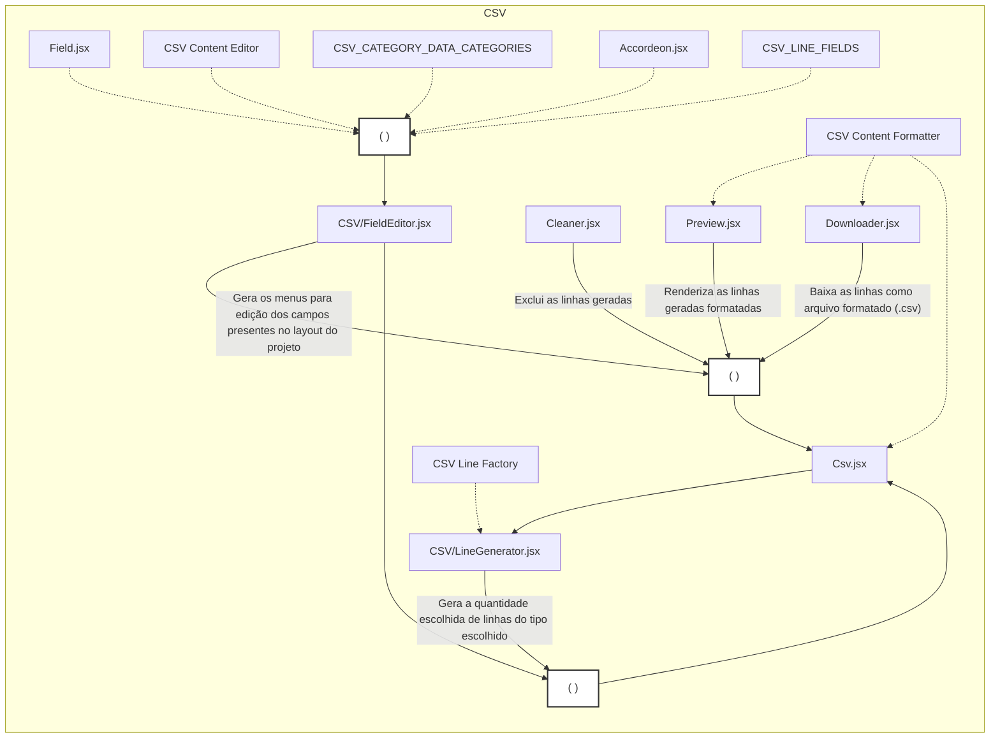

# Estrutura do Gerador CSV

## Visão Geral
O gerador CSV é composto por diversos componentes e scripts que trabalham em conjunto para criar arquivos CSV de cobrança. Este documento apresenta a arquitetura e o fluxo de dados do sistema.

## Diagrama de Arquitetura



## Componentes Principais

### 📄 `Csv.jsx`
**Caminho**: `src/pages/Csv.jsx`

Componente principal da página de geração CSV. Orquestra todos os outros componentes e gerencia o estado das linhas geradas.

**Responsabilidades**:
- Gerenciar estado das linhas geradas
- Coordenar componentes filhos (Preview, Cleaner, Downloader, etc.)
- Passar dados entre componentes

---

### 🎨 `Preview.jsx`
**Caminho**: `src/components/Preview.jsx`

Exibe as linhas CSV geradas em formato de pré-visualização.

**Funcionalidades**:
- Renderiza linhas formatadas
- Usa `ContentFormatter` para formatar dados
- Exibe preview do arquivo final

---

### 🧹 `Cleaner.jsx`
**Caminho**: `src/components/Cleaner.jsx`

Botão para limpar/excluir todas as linhas geradas.

**Funcionalidades**:
- Limpa estado das linhas
- Reset do gerador

---

### 💾 `Downloader.jsx`
**Caminho**: `src/components/Downloader.jsx`

Componente responsável por baixar o arquivo CSV.

**Funcionalidades**:
- Formata conteúdo usando `ContentFormatter`
- Gera arquivo `.csv` para download
- Cria blob e trigger de download

---

### ⚙️ `CSV/LineGenerator.jsx`
**Caminho**: `src/components/CSV/LineGenerator.jsx`

Componente para geração de novas linhas CSV.

**Funcionalidades**:
- Interface para escolher quantidade de linhas
- Usa `LineFactory` para criar linhas
- Adiciona linhas ao estado do componente pai

**Dependências**:
- `LineFactory` - Cria linhas baseado nos campos configurados

---

### ✏️ `CSV/FieldEditor.jsx`
**Caminho**: `src/components/CSV/FieldEditor.jsx`

Editor de campos CSV, permite personalizar valores de cada campo.

**Funcionalidades**:
- Renderiza formulários para edição de campos
- Usa `LineFields` para saber quais campos existem
- Organiza campos por categorias
- Usa `Accordeon` para UI expansível

**Dependências**:
- `Field.jsx` - Componente individual de campo
- `ContentEditor` - Lógica de edição
- `DataCategories` - Categorização dos campos
- `Accordeon.jsx` - UI de accordion
- `LineFields` - Definição dos campos

---

### 🔤 `Field.jsx`
**Caminho**: `src/components/Field.jsx`

Componente reutilizável para renderizar um campo individual.

**Funcionalidades**:
- Renderiza input para campo
- Gerencia valor do campo
- Validação básica

---

### 📦 `Accordeon.jsx`
**Caminho**: `src/components/Accordeon.jsx`

Componente de UI para seções expansíveis/colapsáveis.

**Funcionalidades**:
- Agrupa campos por categoria
- Expande/colapsa seções
- Aceita estilos personalizados via props

---

## Scripts e Utilitários

### 🏭 `CSV Line Factory`
**Caminho**: `src/scripts/CSV/lineFactory.js`

Factory function que cria linhas CSV baseado nos campos configurados.

**Funcionalidades**:
- Lê configuração de `LineFields`
- Aplica valores default
- Retorna linha formatada

---

### 📋 `CSV_LINE_FIELDS`
**Caminho**: `src/scripts/CSV/lineFields.js`

Configuração dos campos do CSV.

**Estrutura**:
```javascript
const CSV_LINE_FIELDS = [
  {
    name: 'campo',
    description: 'Descrição',
    defaultValue: () => 'valor',
    category: 'payer' | 'grantor' | 'asset',
  }
]
```

**Categorias**:
- `payer` - Campos do pagador
- `grantor` - Campos do sacador avalista
- `asset` - Campos do título/cobrança

---

### 🏷️ `CSV_CATEGORY_DATA_CATEGORIES`
**Caminho**: `src/scripts/CSV/categoryTranslation.js`

Tradução e configuração das categorias de campos.

**Funcionalidades**:
- Define labels das categorias
- Organiza campos por categoria
- Usado pelo `FieldEditor`

---

### ✏️ `CSV Content Editor`
**Caminho**: `src/scripts/CSV/contentEditor.js`

Lógica para edição de conteúdo CSV.

**Funcionalidades**:
- Atualiza valores de campos
- Valida alterações
- Mantém integridade dos dados

---

### 🎨 `CSV Content Formatter`
**Caminho**: `src/scripts/CSV/contentFormatter.js`

Formata conteúdo CSV para exibição e download.

**Funcionalidades**:
- Converte linhas para formato CSV
- Adiciona separadores (vírgulas)
- Formata para preview e arquivo

**Usado por**:
- `Preview.jsx`
- `Downloader.jsx`
- `Csv.jsx`

---

## Fluxo de Dados

### 1. Geração de Linhas
```
Usuário define quantidade
    ↓
LineGenerator.jsx
    ↓
LineFactory (usa LineFields)
    ↓
Novas linhas adicionadas ao estado
    ↓
Preview.jsx atualiza
```

### 2. Edição de Campos
```
Usuário abre FieldEditor
    ↓
FieldEditor renderiza campos (LineFields)
    ↓
Accordeon agrupa por categoria (DataCategories)
    ↓
Field.jsx para cada campo
    ↓
ContentEditor atualiza valores
    ↓
Estado atualizado
```

### 3. Download
```
Usuário clica em Download
    ↓
Downloader.jsx
    ↓
ContentFormatter formata linhas
    ↓
Blob criado com conteúdo CSV
    ↓
Arquivo baixado
```

### 4. Limpeza
```
Usuário clica em Limpar
    ↓
Cleaner.jsx
    ↓
Estado resetado
    ↓
Preview limpa
```

## Relacionamentos entre Componentes

### Componentes de UI (Sólidos)
Linhas sólidas no diagrama indicam componentes React que renderizam UI:
- `Csv.jsx` ← componente raiz
- `Preview.jsx`, `Cleaner.jsx`, `Downloader.jsx` ← utilidades
- `LineGenerator.jsx`, `FieldEditor.jsx` ← geradores/editores
- `Field.jsx`, `Accordeon.jsx` ← componentes reutilizáveis

### Scripts/Utilitários (Pontilhados)
Linhas pontilhadas indicam dependências de scripts/configurações:
- `LineFactory` - função pura de geração
- `ContentFormatter` - função de formatação
- `ContentEditor` - lógica de edição
- `LineFields` - configuração de campos
- `DataCategories` - configuração de categorias

## Extensibilidade

### Para adicionar um novo campo CSV:
1. Edite `src/scripts/CSV/lineFields.js`
2. Adicione objeto com `name`, `description`, `defaultValue`, `category`
3. O campo aparecerá automaticamente no `FieldEditor`

### Para adicionar uma nova categoria:
1. Edite `src/scripts/CSV/categoryTranslation.js`
2. Adicione nova categoria ao objeto de tradução
3. Use a nova categoria em `lineFields.js`

### Para personalizar o formato de saída:
1. Edite `src/scripts/CSV/contentFormatter.js`
2. Ajuste a função de formatação conforme necessário

## Arquivos Principais

```
src/
├── pages/
│   └── Csv.jsx                          # Página principal
├── components/
│   ├── Preview.jsx                      # Preview de linhas
│   ├── Cleaner.jsx                      # Botão limpar
│   ├── Downloader.jsx                   # Botão download
│   ├── Field.jsx                        # Campo individual
│   ├── Accordeon.jsx                    # UI accordion
│   └── CSV/
│       ├── LineGenerator.jsx            # Gerador de linhas
│       └── FieldEditor.jsx              # Editor de campos
└── scripts/
    └── CSV/
        ├── lineFactory.js               # Factory de linhas
        ├── lineFields.js                # Configuração de campos
        ├── categoryTranslation.js       # Tradução de categorias
        ├── contentEditor.js             # Lógica de edição
        └── contentFormatter.js          # Formatação de conteúdo
```

## Resumo

O gerador CSV é uma arquitetura modular onde:
- **Componentes React** gerenciam UI e interação do usuário
- **Scripts utilitários** contêm lógica de negócio e transformação de dados
- **Arquivos de configuração** definem campos e categorias
- **Factory pattern** é usado para geração de linhas
- **Formatter pattern** é usado para formatação de saída

Esta estrutura facilita manutenção e extensão do sistema!
