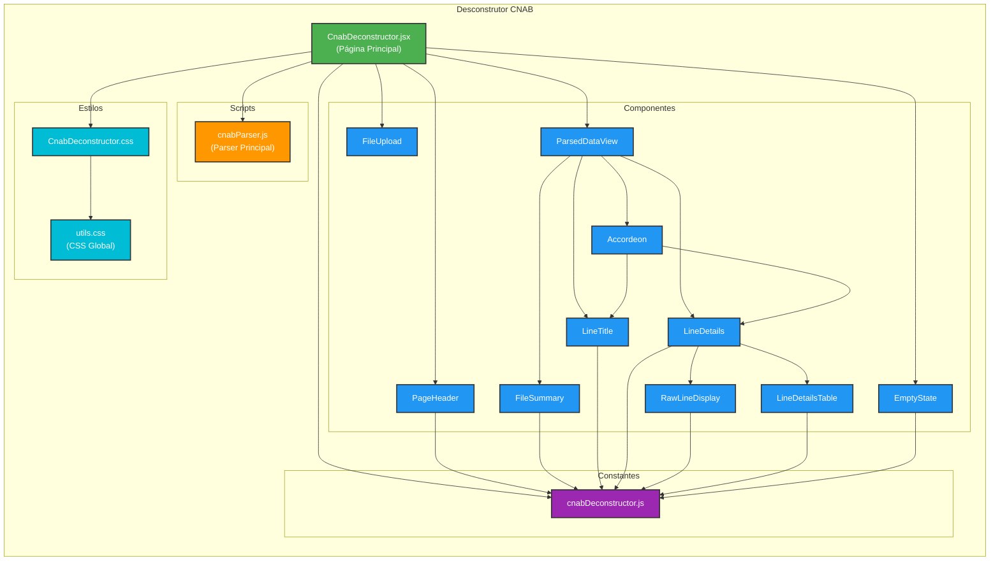
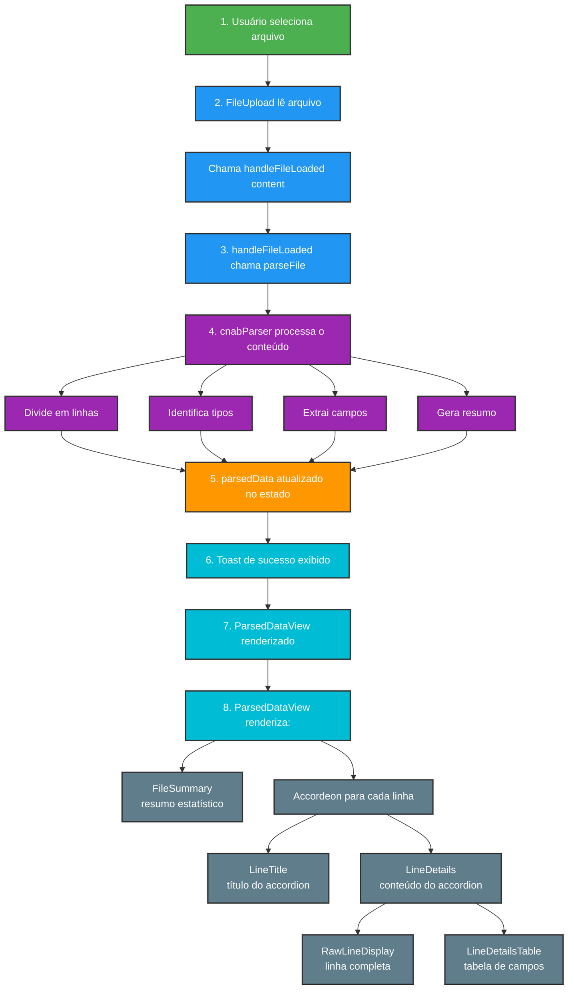

# Estrutura do Desconstrutor CNAB

## Visão Geral
O Desconstrutor CNAB é uma ferramenta que analisa arquivos CNAB 400/444 e exibe todos os campos detalhados de cada linha. A arquitetura foi construída com foco em modularidade, reutilização e manutenibilidade.

## Diagrama de Arquitetura



## Componente Principal

### 📄 `CnabDeconstructor.jsx`
**Caminho**: `src/pages/CnabDeconstructor.jsx`

Componente principal que orquestra todo o fluxo do desconstrutor.

**Responsabilidades**:
- Gerenciar estado do arquivo parseado (`parsedData`)
- Gerenciar estado do nome do arquivo (`fileName`)
- Processar arquivo carregado através do `cnabParser`
- Exibir notificações de sucesso/erro
- Renderizar componentes condicionalmente (dados carregados vs. estado vazio)

**Estado**:
```javascript
const [parsedData, setParsedData] = useState(null);
const [fileName, setFileName] = useState('');
```

**Fluxo de Dados**:
1. Usuário seleciona arquivo → `FileUpload`
2. Arquivo é lido → `handleFileLoaded(content)`
3. Conteúdo é parseado → `parseFile(content)`
4. Estado é atualizado → `setParsedData(parsed)`
5. Notificação é exibida → `Toast.fire(...)`
6. UI é renderizada → `ParsedDataView` ou `EmptyState`

---

## Componentes de UI

### 🎯 `PageHeader.jsx`
**Caminho**: `src/components/CnabDeconstructor/PageHeader.jsx`

Componente genérico que exibe título e subtítulo da página.

**Props**:
- `title` (string): Título da página
- `subtitle` (string): Subtítulo da página

**Uso**:
```jsx
<PageHeader 
  title={UI_TEXT.pageTitle} 
  subtitle={UI_TEXT.pageSubtitle} 
/>
```

---

### 📊 `ParsedDataView.jsx`
**Caminho**: `src/components/CnabDeconstructor/ParsedDataView.jsx`

Componente que orquestra a exibição dos dados parseados.

**Props**:
- `parsedData` (object): Objeto contendo `summary` e `lines`

**Responsabilidades**:
- Renderizar `FileSummary` com estatísticas do arquivo
- Mapear linhas e criar `Accordeon` para cada uma
- Passar dados corretos para `LineTitle` e `LineDetails`

**Estrutura de Dados Esperada**:
```javascript
{
  summary: {
    totalLines: Number,
    header: Number,
    trailer: Number,
    registro1: Number,
    registro2: Number,
    registro3: Number,
    registro7: Number,
    unknown: Number
  },
  lines: [
    {
      lineNumber: Number,
      lineType: String, // 'header', 'registro1', etc.
      rawLine: String,
      error: String | null,
      fields: Array
    }
  ]
}
```

---

### 📈 `FileSummary.jsx`
**Caminho**: `src/components/CnabDeconstructor/FileSummary.jsx`

Exibe resumo estatístico do arquivo parseado.

**Props**:
- `summary` (object): Objeto com contadores de cada tipo de linha

**Funcionalidades**:
- Exibe total de linhas processadas
- Mostra quantidade de headers, trailers e registros
- Destaca linhas não reconhecidas (warning)

---

### 🏷️ `LineTitle.jsx`
**Caminho**: `src/components/CnabDeconstructor/LineTitle.jsx`

Componente que renderiza o título do accordion de cada linha.

**Props**:
- `lineType` (string): Tipo da linha ('header', 'registro1', etc.)
- `lineNumber` (number): Número da linha no arquivo
- `hasError` (boolean): Indica se linha tem erro

**Funcionalidades**:
- Exibe indicador colorido baseado no tipo de linha
- Mostra número e tipo da linha
- Exibe ícone de erro quando aplicável

**Classes CSS por Tipo**:
- `.line-title__indicator--header` → Verde (#4CAF50)
- `.line-title__indicator--registro1` → Azul (#2196F3)
- `.line-title__indicator--registro2` → Laranja (#FF9800)
- `.line-title__indicator--registro3` → Roxo (#9C27B0)
- `.line-title__indicator--registro7` → Ciano (#00BCD4)
- `.line-title__indicator--trailer` → Vermelho (#F44336)
- `.line-title__indicator--unknown` → Cinza (#9E9E9E)

---

### 📝 `LineDetails.jsx`
**Caminho**: `src/components/CnabDeconstructor/LineDetails.jsx`

Componente orquestrador que exibe os detalhes completos de uma linha.

**Props**:
- `line` (object): Objeto com todos os dados da linha

**Responsabilidades**:
- Exibir mensagem de erro (se existir)
- Renderizar `RawLineDisplay` com linha completa
- Renderizar `LineDetailsTable` com campos extraídos

---

### 💻 `RawLineDisplay.jsx`
**Caminho**: `src/components/CnabDeconstructor/RawLineDisplay.jsx`

Exibe a linha CNAB completa em formato monospace.

**Props**:
- `rawLine` (string): Linha completa sem processamento

**Funcionalidades**:
- Exibe linha em font monoespaçada
- Mostra contagem de caracteres
- Permite scroll horizontal para linhas longas
- Usa classe `.code-block` (global)

---

### 📋 `LineDetailsTable.jsx`
**Caminho**: `src/components/CnabDeconstructor/LineDetailsTable.jsx`

Renderiza tabela com todos os campos extraídos da linha.

**Props**:
- `fields` (array): Array de objetos com informações dos campos

**Estrutura de Campo**:
```javascript
{
  name: String,           // Nome técnico do campo
  description: String,    // Descrição legível
  startIndex: Number,     // Posição inicial
  endIndex: Number,       // Posição final
  length: Number,         // Tamanho do campo
  display: String,        // Valor formatado/limpo
  raw: String            // Valor bruto
}
```

**Funcionalidades**:
- Tabela zebrada (linhas alternadas)
- Destaca valores preenchidos
- Mostra valores vazios como "(vazio)"
- Exibe valor bruto quando diferente do formatado
- Retorna `null` se não houver campos

---

### 🚫 `EmptyState.jsx`
**Caminho**: `src/components/CnabDeconstructor/EmptyState.jsx`

Componente genérico de estado vazio.

**Props**:
- `message` (string): Mensagem a ser exibida

**Uso**:
```jsx
<EmptyState message={UI_TEXT.emptyStateMessage} />
```

**Características**:
- Reutilizável em qualquer parte da aplicação
- Usa classe `.empty-state` (global)
- Centralizado com padding adequado

---

## Scripts e Utilitários

### 🔧 `cnabParser.js`
**Caminho**: `src/scripts/CNAB/cnabParser.js`

Script responsável por parsear o conteúdo do arquivo CNAB.

**Função Principal**:
```javascript
export function parseFile(content) {
  // Processa o conteúdo e retorna objeto estruturado
  return {
    summary: { ... },
    lines: [ ... ]
  }
}
```

**Responsabilidades**:
- Dividir arquivo em linhas
- Identificar tipo de cada linha
- Extrair campos baseado no tipo
- Gerar resumo estatístico
- Detectar erros e inconsistências

---

## Constantes

### 📌 `cnabDeconstructor.js`
**Caminho**: `src/constants/cnabDeconstructor.js`

Arquivo centralizado com todas as constantes do desconstrutor.

**Exports**:

#### `LINE_TYPE_LABELS`
Mapeamento de tipos de linha para labels legíveis:
```javascript
{
  header: 'Header',
  registro1: 'Registro 1 (Transação)',
  registro2: 'Registro 2 (Mensagens)',
  // ...
}
```

#### `ACCEPTED_FILE_EXTENSIONS`
Array com extensões aceitas:
```javascript
['txt', 'rem', 'ret']
```

#### `UI_TEXT`
Objeto com todos os textos da interface:
```javascript
{
  pageTitle: 'Desconstrutor CNAB 400/444',
  pageSubtitle: 'Faça upload de um arquivo...',
  buttonText: 'Selecionar Arquivo CNAB',
  // ... mais 20+ textos
}
```

#### `TOAST_MESSAGES`
Configurações de notificações:
```javascript
{
  fileLoaded: {
    icon: 'success',
    title: 'Arquivo carregado!',
    getText: (lineCount) => `${lineCount} linha(s) processada(s)`
  }
}
```

---

## Estilos

### 🎨 `CnabDeconstructor.css`
**Caminho**: `src/styles/components/CnabDeconstructor.css`

Estilos específicos do desconstrutor usando metodologia BEM.

**Principais Classes**:

#### Layout e Estrutura
- `.cnab-deconstructor__title`
- `.cnab-deconstructor__subtitle`
- `.cnab-summary`
- `.cnab-summary__warning`

#### Títulos de Linha
- `.line-title`
- `.line-title__indicator` (círculo colorido)
- `.line-title__indicator--{tipo}` (modificadores de cor)
- `.line-title__error`

#### Detalhes da Linha
- `.line-details`
- `.line-details__error`
- `.line-details__section`
- `.line-details__label`

#### Tabela de Campos
- `.fields-table`
- `.fields-table__header`
- `.fields-table__cell--center`
- `.fields-table__cell--monospace`
- `.fields-table__row--even` / `--odd`
- `.fields-table__value--filled` / `--empty`
- `.fields-table__raw-indicator`

**Variáveis CSS Utilizadas**:
```css
--danger-color          /* Cor de erro/aviso */
--muted-color          /* Cinza para texto secundário */
--muted-color-lighter  /* Cinza mais escuro */
--bg-light            /* Fundo claro (zebra striping) */
--bg-error-light      /* Fundo de erro */
--border-color        /* Cor de borda padrão */
--border-color-dark   /* Cor de borda escura */
```

---

### 🌐 `utils.css`
**Caminho**: `src/styles/utils.css`

CSS global com utilitários compartilhados.

**Classes adicionadas pelo Desconstrutor**:

#### `.empty-state`
Estado vazio genérico:
```css
.empty-state {
  text-align: center;
  padding: 40px;
  color: var(--muted-color);
}
```

#### `.code-block`
Exibição de código/texto monospace:
```css
.code-block {
  padding: 10px;
  background-color: var(--bg-light);
  font-family: monospace;
  font-size: 12px;
  overflow-x: auto;
  border: 1px solid var(--border-color);
  border-radius: 4px;
}
```

**Variáveis CSS adicionadas**:
```css
--muted-color: #999;
--muted-color-lighter: #666;
--bg-light: #f9f9f9;
--bg-error-light: #ffebee;
--border-color: #e0e0e0;
--border-color-dark: #ccc;
```

---

## Fluxo de Dados Completo



---

## Princípios de Design

### 🎯 Single Responsibility
Cada componente tem uma responsabilidade única e bem definida.

### 🔄 Reusabilidade
Componentes genéricos (`PageHeader`, `EmptyState`, `code-block`) podem ser usados em outras partes da aplicação.

### 📦 Encapsulamento
Lógica de apresentação encapsulada em componentes específicos, mantendo o componente principal limpo.

### 🎨 Separação de Concerns
- **Estado**: Gerenciado apenas no componente principal
- **Apresentação**: Delegada aos componentes filhos
- **Estilos**: Separados em arquivo CSS com metodologia BEM
- **Constantes**: Centralizadas em arquivo dedicado

### 🔒 Type Safety
Todos os componentes têm PropTypes definidos para validação de tipos.

---

## Benefícios da Arquitetura

### ✅ Manutenibilidade
- Código limpo e organizado
- Fácil localizar e modificar funcionalidades
- Componentes pequenos e focados

### ✅ Testabilidade
- Componentes isolados podem ser testados individualmente
- PropTypes garantem inputs corretos
- Lógica separada da apresentação

### ✅ Escalabilidade
- Fácil adicionar novos tipos de linha
- Componentes reutilizáveis em novas features
- Estrutura clara para novos desenvolvedores

### ✅ Performance
- Componentes pequenos são mais eficientes
- Re-renders isolados por componente
- Código otimizável individualmente

### ✅ Internacionalização (i18n)
- Todos os textos centralizados em `UI_TEXT`
- Fácil traduzir para outros idiomas
- Sem strings hardcoded no código
