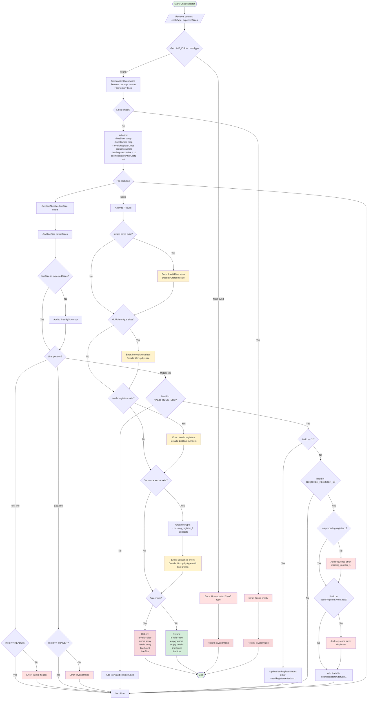

# Estrutura do Validador de CNAB

## Visão Geral
O validador CNAB é responsável por verificar a integridade e conformidade de arquivos CNAB. Este documento apresenta a arquitetura, fluxo de validação e regras aplicadas pelo sistema.

## Diagrama de Fluxo de Validação



## Componentes do Validador

### 📋 Função Principal: `CnabValidator`
**Caminho**: `src/components/CNAB/Validator.jsx`

```javascript
CnabValidator(content, cnabType = '400', expectedSizes = [400, 444])
```

**Parâmetros**:
- `content` (string): Conteúdo do arquivo CNAB
- `cnabType` (string): Tipo de CNAB ('400', '240', etc.)
- `expectedSizes` (array): Tamanhos de linha válidos

**Retorno**:
```javascript
{
  isValid: boolean,           // Se o arquivo passou em todas as validações
  errors: string[],           // Array de mensagens de erro
  details: string[],          // Detalhes dos erros (com HTML para accordion)
  lineCount: number,          // Total de linhas no arquivo
  lineSize: number | string   // Tamanho das linhas ou 'inconsistente'
}
```

---

### 🔧 Configuração: `LINE_IDS`
**Caminho**: `src/scripts/CNAB/lineId.js`

Define as constantes de identificação para cada tipo de CNAB:

```javascript
export const LINE_IDS = {
  400: {
    TRAILER: '9',
    HEADER: '0',
    VALID_REGISTERS: ['1', '2', '3', '7'],
    REQUIRES_REGISTER_1: ['2', '3', '7'],
  },
  // Outros tipos...
}
```

**Propriedades**:
- `TRAILER`: Caractere identificador do trailer (última linha)
- `HEADER`: Caractere identificador do header (primeira linha)
- `VALID_REGISTERS`: IDs válidos para registros intermediários
- `REQUIRES_REGISTER_1`: Registros que precisam de um registro '1' precedente

---

## Validações Realizadas

### 1️⃣ Validação de Tipo CNAB
**Fase**: Inicial

Verifica se o tipo de CNAB especificado é suportado.

```javascript
const lineIds = LINE_IDS[cnabType];
if (!lineIds) {
  return { isValid: false, errors: ['Tipo de CNAB não suportado'] };
}
```

**Erro possível**: "Tipo de CNAB não suportado: {tipo}"

---

### 2️⃣ Validação de Conteúdo Vazio
**Fase**: Após split

Verifica se o arquivo possui linhas válidas.

```javascript
const lines = content.split('\n')
  .map(line => line.replace(/\r/g, ''))
  .filter(line => line.length > 0);

if (lines.length === 0) {
  return { isValid: false, errors: ['O arquivo está vazio'] };
}
```

**Erro possível**: "O arquivo está vazio"

---

### 3️⃣ Validação de Tamanho de Linha
**Fase**: Durante loop

Verifica se cada linha tem um tamanho válido (ex: 400 ou 444 caracteres).

```javascript
if (!expectedSizes.includes(lineSize)) {
  // Agrupa linhas por tamanho inválido
  linesBySize[lineSize].push(lineNumber);
}
```

**Erro gerado**: "Tamanhos de linha inválidos encontrados: {tamanhos}"

**Detalhes**: Linhas agrupadas por tamanho com números de linha

---

### 4️⃣ Validação de Consistência de Tamanho
**Fase**: Após loop

Verifica se todas as linhas têm o mesmo tamanho.

```javascript
const uniqueSizes = [...new Set(lineSizes)];
if (uniqueSizes.length > 1 && invalidSizes.length === 0) {
  // Todas as linhas têm tamanhos válidos, mas são diferentes
}
```

**Erro gerado**: "Todas as linhas devem ter o mesmo tamanho"

**Detalhes**: Agrupa linhas por tamanho diferente do esperado

---

### 5️⃣ Validação de Header
**Fase**: Primeira linha

Verifica se a primeira linha começa com o caractere correto.

```javascript
if (index === 0 && lineId !== HEADER) {
  errors.push(`Header inválido: primeira linha deve começar com '${HEADER}'`);
}
```

**Erro possível**: "Header inválido: primeira linha deve começar com '0', mas começa com '{char}'"

---

### 6️⃣ Validação de Trailer
**Fase**: Última linha

Verifica se a última linha começa com o caractere correto.

```javascript
if (index === lines.length - 1 && lineId !== TRAILER) {
  errors.push(`Trailer inválido: última linha deve começar com '${TRAILER}'`);
}
```

**Erro possível**: "Trailer inválido: última linha deve começar com '9', mas começa com '{char}'"

---

### 7️⃣ Validação de ID de Registro
**Fase**: Linhas intermediárias

Verifica se o ID do registro (primeiro caractere) é válido.

```javascript
if (index > 0 && index < lines.length - 1) {
  if (!VALID_REGISTERS.includes(lineId)) {
    invalidRegisterLines.push(lineNumber);
  }
}
```

**Erro gerado**: "Registros inválidos: {N} linha(s) com identificador inválido"

**Detalhes**: Lista de números de linha com IDs inválidos

---

### 8️⃣ Validação de Sequência de Registros
**Fase**: Linhas intermediárias

Verifica se registros que precisam de um registro '1' precedente estão corretos.

#### 8.1 Registro '1' (Reset)
```javascript
if (lineId === '1') {
  lastRegister1Index = index;
  seenRegistersAfterLast1.clear();
}
```

#### 8.2 Registros que Requerem '1' Precedente
```javascript
if (REQUIRES_REGISTER_1.includes(lineId)) {
  if (lastRegister1Index === -1 || ...) {
    // Erro: falta registro 1 precedente
  }
}
```

**Erro gerado**: "Registros sem registro '1' precedente"

**Detalhes**: Lista de linhas que precisam de registro '1' antes

---

### 9️⃣ Validação de Duplicação de Registros
**Fase**: Linhas intermediárias

Verifica se registros estão duplicados (exceto registro '1').

```javascript
if (seenRegistersAfterLast1.has(lineId)) {
  // Erro: registro duplicado
}
seenRegistersAfterLast1.add(lineId);
```

**Erro gerado**: "Registros duplicados"

**Detalhes**: Lista de linhas com registros duplicados

**Regra**: Apenas registro '1' pode repetir

---

## Estrutura de Erros e Detalhes

### Formato de Erro
```javascript
errors: [
  "Tamanhos de linha inválidos encontrados: 401, 445",
  "Header inválido: primeira linha deve começar com '0'",
  "Registros inválidos: 3 linha(s) com identificador inválido",
  "Erros de sequência: 5 problema(s) de ordenação ou duplicação"
]
```

### Formato de Detalhes (HTML)
Os detalhes são formatados com HTML para serem renderizados em accordions:

```html
<strong>3 linha(s) com 401 caracteres (esperado: 400 ou 444):</strong> Linhas 5, 12, 18

<strong>Registros sem registro '1' precedente (2):</strong>
Linha 3: Registro '2' deve ser precedido por um registro '1'
Linha 5: Registro '3' deve ser precedido por um registro '1'

<strong>Registros duplicados (1):</strong>
Linha 8: Registro '2' está duplicado
```

---

## Componentes de UI

### 📄 `Cnab400Validator.jsx`
**Caminho**: `src/pages/Cnab400Validator.jsx`

Página que usa o validador para CNAB 400/444.

```javascript
const result = CnabValidator(content, '400', [400, 444]);
```

---

### 📤 `FileUpload.jsx`
**Caminho**: `src/components/CNAB/FileUpload.jsx`

Componente para upload de arquivo.

**Validações de UI**:
- Aceita apenas `.txt` ou `.rem`
- Lê conteúdo com `FileReader`
- Passa conteúdo para validador

---

### ✅ `Result.jsx`
**Caminho**: `src/components/CNAB/validation/Result.jsx`

Exibe resultados da validação.

**Funcionalidades**:
- Mostra ícone de sucesso/erro
- Lista erros encontrados
- Renderiza detalhes em accordions
- Usa `parseDetail` para extrair summary e lines dos detalhes HTML

---

### 📜 `Rules.jsx`
**Caminho**: `src/components/CNAB/validation/Rules.jsx`

Exibe as regras de validação.

**Regras mostradas**:
- Extensão do arquivo
- Tamanho das linhas
- Consistência de tamanho
- Header e trailer
- IDs de registro válidos
- Sequência de registros

---

## Fluxo de Validação Detalhado

### Fase 1: Inicialização
1. Recebe `content`, `cnabType`, `expectedSizes`
2. Busca configuração em `LINE_IDS[cnabType]`
3. Se não encontrar, retorna erro

### Fase 2: Preparação
4. Split do conteúdo por `\n`
5. Remove `\r` (carriage return)
6. Filtra linhas vazias
7. Se não houver linhas, retorna erro

### Fase 3: Loop de Validação (Uma Passada)
8. Para cada linha:
   - Extrai número, tamanho e ID
   - Valida tamanho
   - Valida posição (header/trailer/middle)
   - Valida ID de registro
   - Valida sequência de registros
   - Detecta duplicações

### Fase 4: Análise de Resultados
9. Agrupa erros de tamanho
10. Verifica consistência
11. Relata registros inválidos
12. Agrupa erros de sequência

### Fase 5: Retorno
13. Monta objeto de retorno
14. Define `isValid` baseado em erros
15. Retorna resultado completo

---

## Otimizações

### ✅ Single Pass Validation
Todas as validações são feitas em **uma única iteração** sobre as linhas:
- Tamanho de linha
- Header/Trailer
- IDs de registro
- Sequência de registros
- Duplicações

### ✅ Agrupamento Eficiente
Erros são agrupados por tipo e tamanho:
- Linhas com mesmo tamanho inválido são agrupadas
- Erros de sequência são categorizados
- Facilita visualização e correção

### ✅ Detecção Precoce
Alguns erros causam retorno imediato:
- Tipo de CNAB não suportado
- Arquivo vazio

---

## Exemplo de Uso

```javascript
import CnabValidator from './components/CNAB/Validator';

const fileContent = `0REMESSA01...
1REGISTRO1...
2REGISTRO2...
9TRAILER...`;

const result = CnabValidator(fileContent, '400', [400, 444]);

if (result.isValid) {
  console.log('Arquivo válido!');
  console.log(`Total de linhas: ${result.lineCount}`);
} else {
  console.log('Arquivo inválido:');
  result.errors.forEach(error => console.log(`- ${error}`));
  
  // Exibir detalhes em accordion
  result.details.forEach(detail => {
    // Renderizar com dangerouslySetInnerHTML
  });
}
```

---

## Extensibilidade

### Adicionar novo tipo de CNAB:
1. Edite `src/scripts/CNAB/lineId.js`
2. Adicione entrada no objeto `LINE_IDS`
3. Defina `HEADER`, `TRAILER`, `VALID_REGISTERS`, `REQUIRES_REGISTER_1`

### Adicionar nova validação:
1. Edite `src/components/CNAB/Validator.jsx`
2. Adicione lógica no loop ou após análise
3. Popule arrays `errors` e `details`

### Personalizar mensagens:
1. Edite mensagens de erro no validador
2. Atualize `validationRules` na página do validador

---

## Resumo

O validador CNAB é um sistema robusto que:
- ✅ **Valida em uma única passada** (eficiente)
- ✅ **Agrupa erros** por tipo e categoria
- ✅ **Fornece detalhes precisos** com números de linha
- ✅ **Suporta múltiplos tipos** de CNAB (extensível)
- ✅ **Valida sequências complexas** de registros
- ✅ **Remove caracteres especiais** (compatível Windows/Unix)
- ✅ **Interface clara** com accordions para detalhes
- ✅ **Retorno estruturado** para fácil integração

Para adicionar suporte a novos tipos de CNAB, consulte:
- [Adicionando um Novo Validador CNAB](adicionar-validador-cnab.md)
