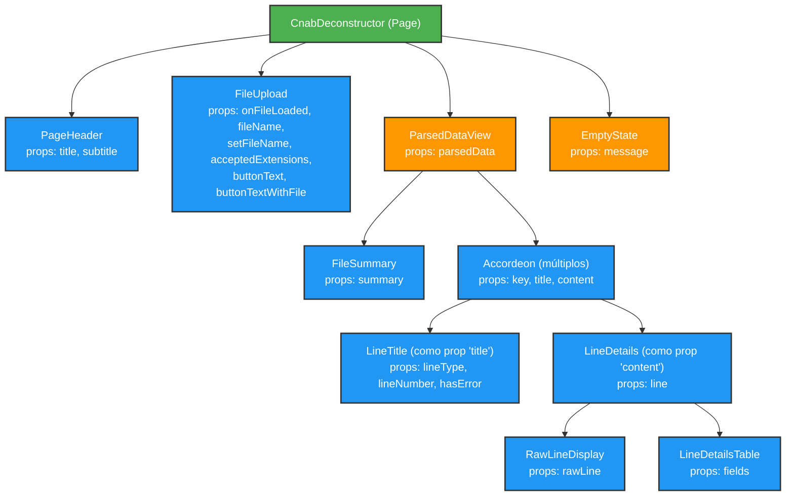
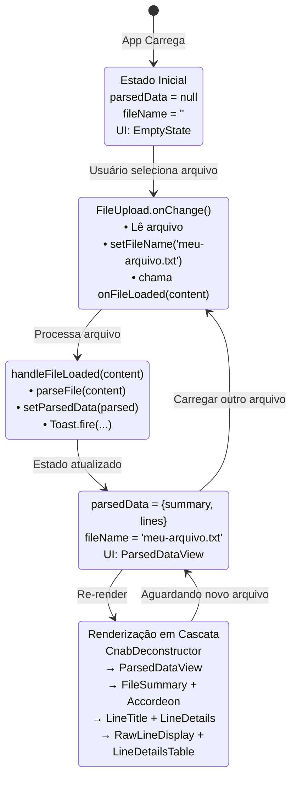
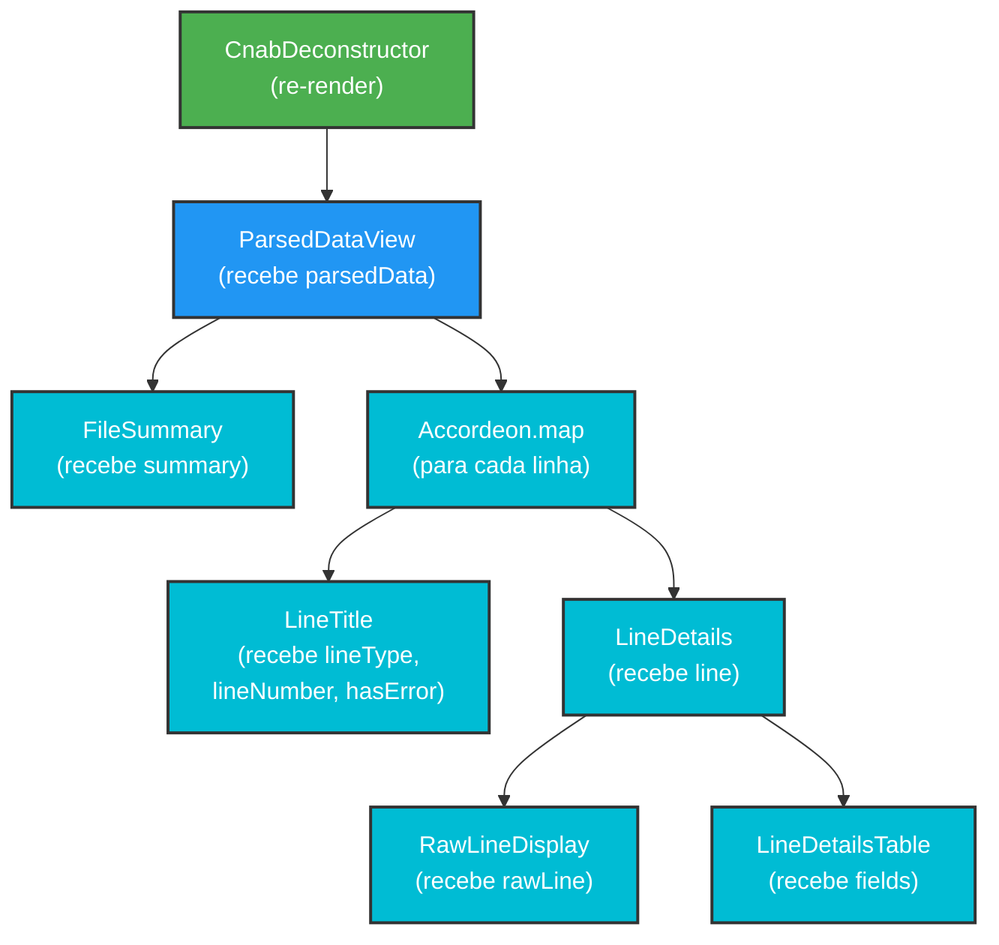
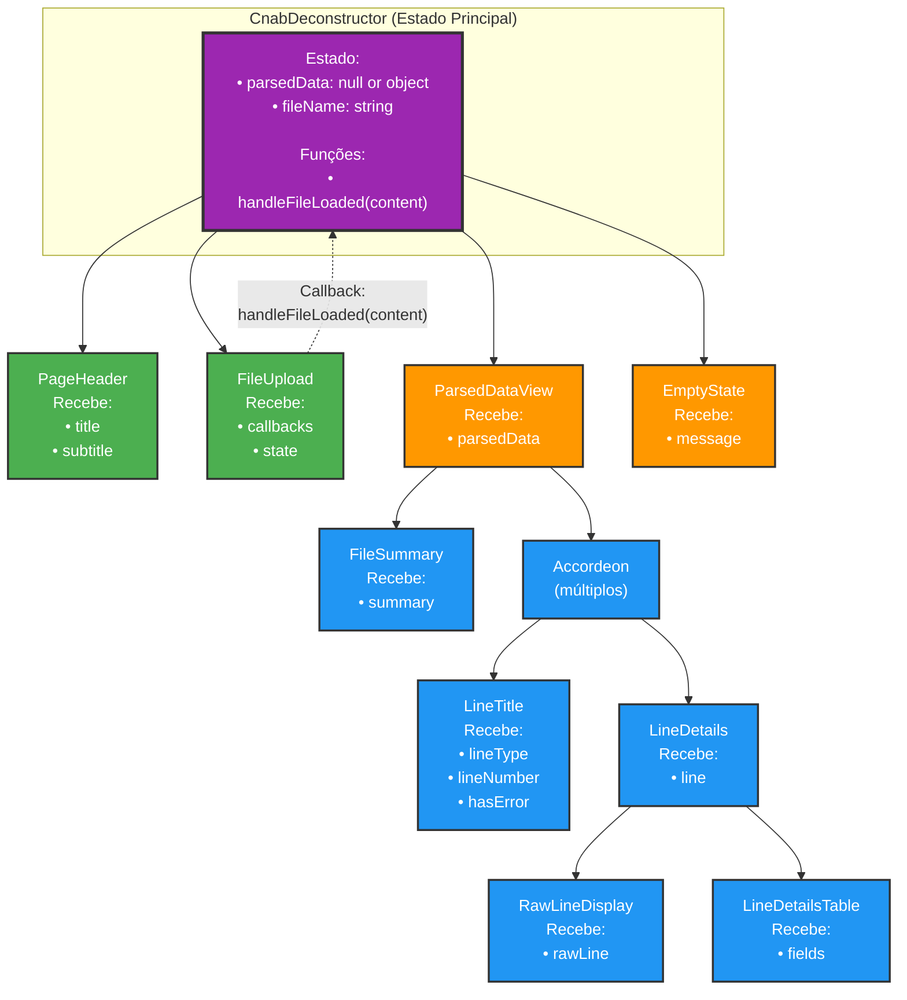

# Mapeamento de Componentes - Desconstrutor CNAB

## Visão Geral
Este documento mapeia como os dados fluem através dos componentes do Desconstrutor CNAB, mostrando exatamente quais props são passadas e como os componentes se comunicam.

---

## Árvore de Componentes



---

## Fluxo de Dados Detalhado

### 1. CnabDeconstructor → PageHeader

```javascript
// CnabDeconstructor.jsx
<PageHeader 
  title={UI_TEXT.pageTitle}        // "Desconstrutor CNAB 400/444"
  subtitle={UI_TEXT.pageSubtitle}  // "Faça upload de um arquivo..."
/>
```

**Dados**:
- `title` (string): Vem de constante
- `subtitle` (string): Vem de constante

**Fluxo**: Unidirecional (dados → componente)

---

### 2. CnabDeconstructor → FileUpload

```javascript
// CnabDeconstructor.jsx
const [fileName, setFileName] = useState('');

<FileUpload
  onFileLoaded={handleFileLoaded}              // function
  fileName={fileName}                           // string (estado)
  setFileName={setFileName}                     // function (setState)
  acceptedExtensions={ACCEPTED_FILE_EXTENSIONS} // ['txt', 'rem', 'ret']
  buttonText={UI_TEXT.buttonText}               // "Selecionar Arquivo CNAB"
  buttonTextWithFile={UI_TEXT.buttonTextWithFile} // "Carregar Outro Arquivo"
/>
```

**Dados**:
- `onFileLoaded` (function): Callback quando arquivo é carregado
- `fileName` (string): Nome do arquivo atual
- `setFileName` (function): Atualiza fileName no estado pai
- `acceptedExtensions` (array): Extensões permitidas
- `buttonText` (string): Texto do botão inicial
- `buttonTextWithFile` (string): Texto do botão após upload

**Fluxo**: Bidirecional
- Pai → Filho: `fileName`, configurações
- Filho → Pai: `onFileLoaded(content)`, `setFileName(name)`

---

### 3. CnabDeconstructor → ParsedDataView

```javascript
// CnabDeconstructor.jsx
const [parsedData, setParsedData] = useState(null);

// Estrutura de parsedData:
{
  summary: {
    totalLines: 150,
    header: 1,
    trailer: 1,
    registro1: 100,
    registro2: 20,
    registro3: 15,
    registro7: 13,
    unknown: 0
  },
  lines: [
    {
      lineNumber: 1,
      lineType: 'header',
      rawLine: '01REMESSA01COBRANCA...',
      error: null,
      fields: [...]
    },
    // ... mais linhas
  ]
}

<ParsedDataView parsedData={parsedData} />
```

**Dados**:
- `parsedData` (object): Objeto completo com summary e lines
  - `summary` (object): Estatísticas do arquivo
  - `lines` (array): Array de objetos de linha

**Fluxo**: Unidirecional (dados → componente)

---

### 4. ParsedDataView → FileSummary

```javascript
// ParsedDataView.jsx
<FileSummary summary={parsedData.summary} />
```

**Dados Passados**:
```javascript
{
  totalLines: 150,
  header: 1,
  trailer: 1,
  registro1: 100,
  registro2: 20,
  registro3: 15,
  registro7: 13,
  unknown: 0
}
```

**Uso no FileSummary**:
```jsx
<p><strong>{UI_TEXT.totalLinesLabel}</strong> {summary.totalLines}</p>
<p><strong>{UI_TEXT.headerLabel}</strong> {summary.header}</p>
// ... etc
```

**Fluxo**: Unidirecional (dados → componente)

---

### 5. ParsedDataView → Accordeon → LineTitle

```javascript
// ParsedDataView.jsx
{parsedData.lines.map((line, index) => (
  <Accordeon 
    key={index}
    title={<LineTitle 
      lineType={line.lineType}      // 'header' | 'registro1' | etc.
      lineNumber={line.lineNumber}  // 1, 2, 3...
      hasError={!!line.error}       // true | false
    />}
    content={...}
  />
))}
```

**Dados para LineTitle**:
- `lineType` (string): Tipo da linha
- `lineNumber` (number): Número da linha no arquivo
- `hasError` (boolean): Se linha tem erro

**Como LineTitle Usa**:
```jsx
// Busca label da constante
{LINE_TYPE_LABELS[lineType] || lineType}

// Escolhe classe CSS baseada no tipo
className={`line-title__indicator line-title__indicator--${lineType}`}

// Mostra warning se tem erro
{hasError && <span className="line-title__error">⚠️</span>}
```

**Fluxo**: Unidirecional (dados → componente)

---

### 6. ParsedDataView → Accordeon → LineDetails

```javascript
// ParsedDataView.jsx
<Accordeon 
  content={<LineDetails line={line} />}
/>
```

**Estrutura de `line`**:
```javascript
{
  lineNumber: 1,
  lineType: 'registro1',
  rawLine: '1001000018253460000112345671...',  // 400/444 chars
  error: 'Erro ao processar campo X',  // ou null
  fields: [
    {
      name: 'codigoCarteira',
      description: 'Código Carteira',
      startIndex: 22,
      endIndex: 24,
      length: 3,
      display: '001',
      raw: '001'
    },
    // ... mais campos
  ]
}
```

**Fluxo**: Unidirecional (dados → componente)

---

### 7. LineDetails → RawLineDisplay

```javascript
// LineDetails.jsx
<RawLineDisplay rawLine={line.rawLine} />
```

**Dados**:
- `rawLine` (string): Linha completa sem processamento (400 ou 444 chars)

**Como RawLineDisplay Usa**:
```jsx
<strong>
  {UI_TEXT.completeLineLabel} ({rawLine.length} {UI_TEXT.charactersLabel}):
</strong>
<div className="code-block">
  {rawLine}
</div>
```

**Fluxo**: Unidirecional (dados → componente)

---

### 8. LineDetails → LineDetailsTable

```javascript
// LineDetails.jsx
<LineDetailsTable fields={line.fields} />
```

**Estrutura de `fields`**:
```javascript
[
  {
    name: 'codigoCarteira',
    description: 'Código Carteira',
    startIndex: 22,
    endIndex: 24,
    length: 3,
    display: '001',      // Valor formatado/limpo
    raw: '001'           // Valor original
  },
  {
    name: 'agenciaBeneficiario',
    description: 'Agência Beneficiário',
    startIndex: 25,
    endIndex: 29,
    length: 5,
    display: '00001',
    raw: '00001'
  },
  // ... ~30-40 campos dependendo do tipo
]
```

**Como LineDetailsTable Usa**:
```jsx
<tbody>
  {fields.map((field, fieldIndex) => (
    <tr>
      <td>{field.name}</td>
      <td>{field.description}</td>
      <td>{field.startIndex}-{field.endIndex} ({field.length})</td>
      <td>
        {field.display || <em>(vazio)</em>}
        {field.raw !== field.display && (
          <span>(raw: "{field.raw}")</span>
        )}
      </td>
    </tr>
  ))}
</tbody>
```

**Fluxo**: Unidirecional (dados → componente)

---

### 9. CnabDeconstructor → EmptyState

```javascript
// CnabDeconstructor.jsx
{parsedData ? (
  <ParsedDataView parsedData={parsedData} />
) : (
  <EmptyState message={UI_TEXT.emptyStateMessage} />
)}
```

**Dados**:
- `message` (string): "Nenhum arquivo carregado. Selecione um arquivo CNAB para começar."

**Fluxo**: Unidirecional (dados → componente)

---

## Ciclo de Vida Completo



### 5️⃣ Renderização em Cascata



---

## Mapa de Comunicação entre Componentes



---

## Tipos de Props por Categoria

### 📝 Props de Dados (Read-Only)
Componentes que apenas lêem e exibem dados:
- `PageHeader`: title, subtitle
- `FileSummary`: summary
- `LineTitle`: lineType, lineNumber, hasError
- `RawLineDisplay`: rawLine
- `LineDetailsTable`: fields
- `EmptyState`: message
- `ParsedDataView`: parsedData
- `LineDetails`: line

### ⚡ Props de Callback/Funções
Componentes que executam ações:
- `FileUpload`: onFileLoaded, setFileName

### 🔄 Props Mistas
Componentes que lêem dados E executam ações:
- `FileUpload`: 
  - Dados: fileName, acceptedExtensions, buttonText
  - Callbacks: onFileLoaded, setFileName

---

## Convenções de Nomenclatura

### Props de Dados
```javascript
// Singular para objeto
<Component data={...} />
<Component line={...} />
<Component summary={...} />

// Plural para array
<Component fields={[...]} />
<Component lines={[...]} />
<Component items={[...]} />
```

### Props de Callback
```javascript
// Padrão on + Ação
<Component onFileLoaded={...} />
<Component onClick={...} />
<Component onFilterChange={...} />

// Padrão handle + Ação (no componente pai)
const handleFileLoaded = () => {}
const handleClick = () => {}
```

### Props Booleanas
```javascript
// Padrão is/has + Estado
<Component isLoading={true} />
<Component hasError={false} />
<Component isVisible={true} />
```

---

## Debugging Props

### Ver Props no Console
```javascript
// Adicione no componente
console.log('Props recebidas:', { prop1, prop2, prop3 });
```

### Validar Props com PropTypes
```javascript
ComponentName.propTypes = {
  prop1: PropTypes.string.isRequired,  // Obrigatória
  prop2: PropTypes.number,              // Opcional
};

// Console irá avisar se prop estiver errada ou faltando
```

### React DevTools
1. Abra DevTools do Chrome
2. Aba "Components"
3. Selecione componente na árvore
4. Veja props no painel direito

---

## Exemplo Prático Completo

### Cenário: Adicionar campo "Total de Caracteres" no resumo

#### 1. Modificar Parser para incluir dado
```javascript
// cnabParser.js
summary.totalCharacters = lines.reduce((sum, line) => sum + line.length, 0);
```

#### 2. Adicionar texto na constante
```javascript
// cnabDeconstructor.js
export const UI_TEXT = {
  // ...
  totalCharactersLabel: 'Total de Caracteres:',
};
```

#### 3. Usar no componente
```javascript
// FileSummary.jsx
<p><strong>{UI_TEXT.totalCharactersLabel}</strong> {summary.totalCharacters}</p>
```

#### Fluxo de Dados:

```mermaid
graph LR
    A["cnabParser"] -->|cria| B["summary.totalCharacters"]
    B --> C["setParsedData({ summary })"]
    C --> D["parsedData passado<br/>para ParsedDataView"]
    D --> E["parsedData.summary<br/>passado para FileSummary"]
    E --> F["FileSummary renderiza<br/>summary.totalCharacters"]
    
    classDef script fill:#FF9800,stroke:#333,stroke-width:2px,color:#fff
    classDef state fill:#9C27B0,stroke:#333,stroke-width:2px,color:#fff
    classDef component fill:#2196F3,stroke:#333,stroke-width:2px,color:#fff
    
    class A script
    class B,C state
    class D,E,F component
```



---

## Referências Rápidas

### Onde encontrar definições:
- **Props Types**: Dentro de cada componente (`ComponentName.propTypes`)
- **Estrutura de Dados**: `cnabParser.js` (função `parseFile`)
- **Constantes**: `src/constants/cnabDeconstructor.js`
- **Estilos**: `src/styles/components/CnabDeconstructor.css`

### Arquivos principais:
- 📄 `src/pages/CnabDeconstructor.jsx` - Orquestrador
- 🔧 `src/scripts/CNAB/cnabParser.js` - Processador de dados
- 📊 `src/constants/cnabDeconstructor.js` - Configurações
- 🎨 `src/styles/components/CnabDeconstructor.css` - Estilos
